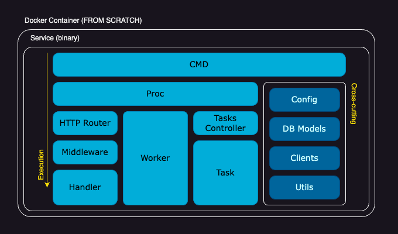

# Codoworks Go Boilerplate

[](https://github.com/codoworks/go-boilerplate/actions/workflows/go.yml)
[](https://goreportcard.com/report/github.com/codoworks/go-boilerplate)
[](https://github.com/codoworks/go-boilerplate/actions/workflows/codeql.yml)
[](https://github.com/codoworks/go-boilerplate/actions/workflows/codacy.yml)


This is a backend service skeleton or boilerplate to speed up development process. Over time, this package has become opinionated and behaves more like a framework with a set of predefined features.
This package was developed using `GoLang v1.21`. 
Thank you for using Codoworks Go Boilerplate. 


```
   ___          _                         _        
  / __\___   __| | _____      _____  _ __| | _____ 
 / /  / _ \ / _  |/ _ \ \ /\ / / _ \| '__| |/ / __|
/ /__| (_) | (_| | (_) \ V  V / (_) | |  |   <\__ \
\____/\___/ \__,_|\___/ \_/\_/ \___/|_|  |_|\_\___/ cli.

```

<details>
<summary><b>Mindset</b></summary>
	
This service is designed for developers to build backend API as quickly as possible - almost as simply as copy and pasting components. The goal is to be able to clone this repository, rename it and get started with your first RESTful CRUD API within minutes.

There are many HTTP libraries on GitHub that enable quick and easy API development, but as your project scales it can quickly become messy without proper structure and workflows, and even more when preparing for production or managing security.

Codoworks Go Boilerplate has all your production needs taken care of in advance, so you can focus your efforts on creating business and application logics.

It's worth noting that this package builds upon [Echo](https://echo.labstack.com) but you can easily adapt it to a different framework.

#### Multi-routers

It's designed with 3 separate routers (public, protected and hidden). Each router has its individual configuration that you can customise to your needs. This enables the following structure:

```
https://your-domain.com/api/<your public api>            # Publicly consumable API
https://api.your-domain.com/<your protected api>         # Your application's API 
https://api.your-domain.com/.admin/<your hidden api>     # Administrative API, not supposed to be available via public internet
```

With this structure, the default router is assumed to be the protected one as most use cases tend to contain a user interface element with a login functionality. 

#### Modular

Speaking of login, this service is designed to be used with self-hosted [ory kratos](https://www.ory.sh/open-source/) for authentication. Since this boilerplate is designed to be modular, you may choose another service provider instead of Kratos. All you have to do is change the authentication.go middleware to your desired service. 

Similarly for authorisation, [ory keto](https://www.ory.sh/open-source/) is the default client for this service as it is well-designed to manage large volumes of transactions.

#### Maintenance

Often, you may need to run something in the background like a cleanup job or perhaps an email watcher. This service is designed with that in mind too. It even provides a watcher that you can run with an http server or indenpendently. Using the same structure you can create your own too.

#### Administration

A well-designed service should also enable the user to perform certain administrative tasks out of the box, like providing a specific user with a given email address or system admin permission. It's likely that a user interface for such feature is not a priority on your product roadmap, hence an API is never developed and as a result, you cannot make use of Postman. To prevent this type of scenario, this boilerplate is shipped with tasks that you can easily extend and execute via command line.

#### Database

Needless to say, almost every service requires a database, this one is no different too. Codowworks Go Boilerplate is designed with MySQL, Postgres and SQLite integration. By default, it uses SQLite to allow a quick start, switching platforms is just a matter of changing an environment variable.

#### Others

Within this boilerplate are also database migrations, logging, routing, hot-reloading, CORS, timeout and even graceful shutdown, which are some of the features you need to get to production as soon as possible. 

We hope you enjoy using Codoworks Go Boilerplate. If you do, please support us by giving this repository a star.
</details>

<details>

<summary><b>Full Feature List</b></summary>

- CLI commands (via Cobra)
- HTTP server (via Echo)
  - Public router
  - Protected router
  - Hidden router
- Daemon processes or workers
- Tasks for custom one-off operations
- Middlewares
  - HTTP header checks and setters
  - Auto error handling and response
  - Authentication via Ory Kratos
  - Authorisation via Ory Keto
  - CORS handling
  - Auto trim trailing slashes
  - Request timeout
  - Gzip responses
  - XSS check
- Databases
  - DB connection (PostgreSQL, MySQL)
  - DB models (ORM using Gorm)
  - DB migrations (using Go Migrate)
  - DB seeds (using Go Migrate)
- JSON forms and model mapping
- Data validation
- Clients
  - Forward HTTP client to forward authorization headers
  - Ory Kratos Client - authentication
  - Ory Keto Client - authorization
- Custom logger
- Graceful shutdown
- Feature toggle: [ory_kratos, ory_keto, db, redis]
</details>

# Getting Started

1. Clone this repository `git clone git@github.com:codoworks/go-boilerplate.git`
2. Run `cd go-boilerplate`
3. Run `go get`
4. Run `go run . db migrate`
5. Run `go run . db seed`
6. Run `go run . start` to start the server, you should see the following
```
⇨ http server started on [::]:8081
⇨ http server started on [::]:8080
⇨ http server started on [::]:8079
```
7. List available routes using `go run . info protected-api-routes` and use your favourite API client to test. or use the following to get started and make sure you're up and running.
```bash
curl -H "Accept: application/json" http://127.0.0.1:8081/health/alive
curl -H "Accept: application/json" http://127.0.0.1:8081/health/ready
```

> Recommended: run `go run .` and explore all available options, it should be straightforward.

For more details on running and using the service, scroll down to "[Operations](#operations)" section. 

To learn about developing and extending this service, scroll down to "[Make it your own](#make-it-your-own)" section. 

#### Simplified Architecture Diagram



<details>
<summary><b>Docker</b></summary>

The service is shipped with a few docker compose files to get you started, all of which are automated with a Makefile to make things consistent.

#### Quick Start

From the boilerplate root folder, run the quick-start target from the Makefile

```bash
make quick-start
```

#### Quick Start with MySQL

To run an example using MySQL database, from the boilerplate root folder, run the quick-start-mysql target from the Makefile

```bash
make quick-start-mysql
```

#### Quick Start with Postgres

To run an example using Postgres database, from the boilerplate root folder, run the quick-start-mysql target from the Makefile

```bash
make quick-start-postgres
```
</details>


<details>
<summary><b>Usage</b></summary>

### Env Vars

Environment variables are evaluated in the following order to allow flexibility when running in production: 
1. `.env` file
2. environment variables 
3. cmd flags (if available)

Example: if you have `HOST=127.0.0.1` in the `.env` file and `$ EXPORT HOST=0.0.0.0` in a terminal, the service will first read the first value in the env file, which is then overriden by the value in the terminal environment. 

During development, it is recommended to use a `.env` file. You can find a reference under `./.env.sample` to get started. 

To ease your development process, we've included a command to print the environment to better understand your app behaviour. Simply run `go run . info env`. Together with `go run . info features` you should be able to get to the bottom of something. 


<details>
<summary><b>List of all available env vars</b></summary>

| Var Name | Required | Description |
| -------- | -------- | ----------- |
| `HOST` | optional | service host address. default: 0.0.0.0 |
| `PROTECTED_API_PORT` | optional | service port. default: 8080 |
| `PUBLIC_API_PORT` | optional | service port. default: 8081 |
| `HIDDEN_API_PORT` | optional | service port. default: 8079 |
| `DB_HOST` | optional | database host |
| `DB_PORT` | optional | database port |
| `DB_USER` | optional | database username |
| `DB_PASSWORD` | optional | database password |
| `DB_NAME` | optional | database name |
| `DB_TIMEZONE` | optional | database timezone. required with postgres platform |
| `DB_PLATFORM` | optional | enum: ["postgres", "mysql", "sqlite"]. default: "sqlite" |
| `KRATOS_PUBLIC_SERVICE` | optional | ory kratos public api url |
| `KRATOS_ADMIN_SERVICE` | optional | ory kratos admin api url |
| `KETO_READ_SERVICE` | optional | ory keto read api url |
| `KETO_WRITE_SERVICE` | optional | ory keto write api url |
| `REDIS_HOST` | optional | redis host url. required if redis is enabled |
| `REDIS_PORT` | optional | redis port. required if redis is enabled |
| `REDIS_PASSWORD` | optional | redis password. required if redis is enabled |
| `LOG_LEVEL` | optional | enum: ["INFO", "WARN", "DEBUG", "ERROR"]. default: "INFO" |
| `CORS_ALLOW_ORIGINS` | optional | allowed origins. default: "*" |
| `REQUEST_TIMEOUT_DURATION` | optional | number in seconds. default: "60" |
| `DISABLE_FEATURES` | optional | list of features to disable in runtime, make sure its comma separated without spaces |
</details>

### Execution Modes

The service can run in one of two modes, production mode or development mode. 

Development mode is activated using the `-d` or `--dev` flag. Running in this mode will lock the service host to `127.0.0.1` to avoid firewall issues when developing using macOS. You can override this setting using `-H 0.0.0.0` if needed. 

Development mode will also activate useful middlewares that help print incoming request body and input data validation errors for debugging, as well as set the logger level to debug to ease development. Everything else is identical to running in production mode.

You can change the behaviour of the service using flags, see the list of flags below for more.

<details>
<summary><b>List of all flags</b></summary>

| Flag Name | Shorthand | type | Description |
| --------- | --------- | ---- | ----------- |
| `--dev` | `-d` | bool | run in development mode |
| `--env` | `-e` | bool | print environment variables |
| `--host` | `-H` | string | (optional) service host. overrides env vars |
| `--port` | `-P` | string | (optional) service port. overrides env vars |
| `--watcher` | (N/A) | bool | (optional) start watcher in the backgoround |
| `--log` | `-l` | string | (optional) log level |
</details>

### Live Reload / Hot-swap <a name="live-reload"></a>

It's convenient to automatically restart the service every time you save your changes, for that you can use [air](https://github.com/cosmtrek/air), which is a separate go package you can install using the following command

```bash
go install github.com/cosmtrek/air@latest
```

once `air` is installed, you simply need to run `air` to start the service. configurations for that can be found under `./.air.toml`

Live reloading will also work in docker, the `Dockerfile.dev` is configured to install and run the service via `air`

### Operations <a name="operations"></a>

This service is shipped with a cmd client, which means you can run `./go-boilerplate` to view all available commands and help menu.

> - You need to build the service first before you can use `go-boilerplate` 
> - both `./go-boilerplate` and `go run .` can be followed by any flags, commands and sub-commands 

### Required Headers

The service requires `Accept: application/json` header by default for all requests. 

It also requires `Content-Type: application/json` with `POST`, `PUT` and `DELETE` requests.

### Native Development 

If you're writing a small project with a few endpoints then running Go in your terminal shouldn't be much of a problem. You can use the [live-reload](#live-reload) while you're editing your code in your favourite editor. 

To run the service without building, run `go run .` this will achieve the same result as `./go-boilerplate` after building the binary.

> The name `go-boilerplate` will change if you have changed the package name [as mentioned here](#change-pkg-name)

### In-Docker Development

However when you're running a large project with multiple micro-services (multiple instances of this boilerplate), it can be handy to live edit your code while in docker, for that we've designed the `Dockerfile.dev` to get your started.

Simply run `make quick-start` to get up and running, and to stop it, use `Ctrl+C`. Make sure you set your env correctly. 

### Build

To build, run `go build .` this will generate a binary with the default name of the package, in this case it will be `./go-boilerplate` unless you've changed it (which is recommend).

If you've executed the above, you may notice the version by running `./go-boilerplate version` is set to `2.x.x-default`, that's because this is the second interation of this boilerplate. It's recommended that you burn the version into the binary in build time to create versioned builds. To do that, use the following command to build instead

```bash
go build -ldflags="-w -s -extldflags '-static' -X main.VERSION=<YOUR.VERION.HERE>"

# Example
go build -ldflags="-w -s -extldflags '-static' -X main.VERSION=1.0.0"
./go-boilerplate version
# v1.0.0
```

Once built, a single binary file is generated, it's an executable that you can rename and place in any folder as long as your profile PATH can find it. a good place to place it on your local machine would be `/usr/bin` which is where most binaries are. 

### Deployment

If you wish to deploy this service locally, all you need to do is build from the above secion and then ship the outputted binary into a location where your terminal's PATH can find it, you should be able to use it by just calling it's name in your terminal. 

The "Usage" section should get you familiar with all configurations required to configure, operate and maintain this service, deploying it should be a piece of cake onto any dockerized environment.

From a container point of view, i'd encourage you to place this binary in an empty container, i.e. `FROM scratch` in Dockerfile. this helps keep the container size minimal. When tested on an M1 Mac Machine, we got an 18MB container. 
</details>

<a name="make-it-your-own"></a>
<details>
<summary><b>Extending the service (Make it your own)</b></summary>

This section is all about extending the service to create your own application and APIs. 

<a name="change-pkg-name"></a>
> The first thing you'd want to do is to change the package name, find `codoworks/go-boilerplate` in all files and replace it with your desired package name. You can choose to use the general `(org-name)/(project-name)` naming pattern for consistency.


<details>
<summary><b>Migrations</b></summary>

Migrations help create your database and track how it eveolves overtime, here we use [GoMigrate](https://github.com/go-gormigrate/gormigrate) to achieve this along with an added implementation to enable easy extendability and better logs throughout your development process. 

Migrations go under `pkg/db/migrations/<myNewMigration>.go`. The way it's implemented uses `Go`'s `init()` function which means they're added to the list in the alphabetical order they appear in, they get migrated in that order (top to bottom), and rollbacked in the reverse order (bottom up). For this it's best to maintain the naming convention of `YYYYMMDD[00-99]_migration_description`.


Here's a sample migration to get you started:
```go
func init() {
	m := &gormigrate.Migration{}

	m.ID = "2022081801_create_cats_table"

	m.Migrate = func(db *gorm.DB) error {
		type Cat struct {
			models.ModelBase
			Name string `gorm:"size:255"`
			Type string `gorm:"size:255"`
		}

		return AutoMigrateAndLog(db, &Cat{}, m.ID)
	}

	m.Rollback = func(db *gorm.DB) error {
		if err := db.Migrator().DropTable("cats"); err != nil {
			logFail(m.ID, err, true)
		}
		logSuccess(m.ID, true)
		return nil
	}

	AddMigration(m)
}
```

The variable `m` holds the migration details and is added to the list of migrations at the end. `m.ID` is the identifier used by `gomigrate` to keep track of the migrations that already ran so make sure to change that for every migration.


Every migration has 2 methods to be implemented, a `Migrate()` and `Rollback()` methods as described above. Make sure you use the `logSuccess`, `logFail` and `AutoMigrateAndLog()` functions to print the migrations that ran. This would come in very handy with remote deployments. 

It's recommended to declare your models within each migration (separately from models) to keep track of how the database schema is changing throughout the project. You can add/delete columns, rename columns and execute raw SQL in migrations.

> A general good practice would be to flatten your migrations once your application achieves version 1, leaving only neat table creation in each migration.
</details>

<details>
<summary><b>Seeds</b></summary>

Seeds are very similar to migrations, the key difference between the two is that seeds do not implement the `Rollback` function. That's because seeds are intended to create content inside the database, they don't modify the database structure in any way so there's no need for rollbacks. 

Just like migrations, seeds are applied once, and tracked using their unique identifier `ID` by [GoMigrate](https://github.com/go-gormigrate/gormigrate).

Seeds are part of the whole package which allows you to access models, clients and other components directly to configure the application or perhaps provide dummy data to enable streamlined development. 

Here's a seed skeleton to get you started, all you need to do is copy the following structure into a new file under seeds and change the `s.ID` property.

```Go
func init() {

	var s = &gormigrate.Migration{}
	s.ID = "2022081801_new_seed"

	s.Migrate = func(db *gorm.DB) error {

		logSuccess(s.ID)
		return nil
	}

	AddSeed(s)
}
```

And here's a sample seed to give an idea of how you can utilise seeds.

```Go
func init() {

	var s = &gormigrate.Migration{}
	s.ID = "2022081801_seed_cats_data"

	s.Migrate = func(db *gorm.DB) error {

		var err error
    var cats []*models.Cat

		cats = append(cats, &models.Cat{
			Name: "Kitty",
			Type: "Persian",
		})

		cats = append(cats, &models.Cat{
			Name: "Tom",
			Type: "Siamese",
		})

    for _, cat := range cats {
      err = cat.Save()
      if err != nil {
        logFail(s.ID, err)
        return err
      }
    }

		logSuccess(s.ID)
		return nil
	}

	AddSeed(s)
}
```
</details>

<details>
<summary><b>Models</b></summary>

Models can sometimes be a complex aspect of any application, in this section you'll find a breakdown on how you can compose your models or database entities. 

#### Model Structure 

The first thing you'd want to do is to create a struct that matches your database schema, almost all models should embed the `ModelBase` struct that provides the `ID`, `CreatedAt` and `UpdatedAt` properties, excepts can be things like a many to many table where you only need to store 2 identifiers. To learn more about model declarations you can refer to [Gorm](https://gorm.io) official comprehensive documentation. 

Here's a Cat model that should correspond to a Cats table in a database, and contains 5 properties, `ID`, `CreatedAt`, `UpdatedAt`, `Name` and `Type`

```Go
type Cat struct {
	ModelBase
	Name string `gorm:"size:255"`
	Type string `gorm:"size:255"`
}
```
Notice how every property contains a `gorm` decoration to specify things like field size, uniqueness or foreign keys etc. For more details please refer to [Gorm](https://gorm.io)'s documentation.

Your model may sometimes contain properties that do not correspond to a database column, to do that you simply need to use the `gorm:"-"` decoration. 

> Note: given this package is designed to work with multiple database servers like mysql or postgres. Some data types may be available in some servers and not others, it's worth testing your application with differnet servers from time to time as you go to accomodate the ease of switching database server, unless your use-case relies on that specific data type in which case you're making an informed decision to lock your application to that server.

#### Common Basic Functionality

Now that you have a structure that corresponds to a table in your database, some common functionality is in order. Generally one would expect at least the basic CRUD functionality, and ofcourse reading can mean one or more records so more functions can be added. Here's a basic CRUD implementation that is required for any model.

- `FindAll()`, for retrieving all records in the table
```Go
func (model *Cat) FindAll() (models []*Cat, err error) {
	result := db.Model(model).Find(&models)
	return models, result.Error
}
```

- `FindMany()`, for retrieving many items given an array of IDs
```Go
func (model *Cat) FindMany(ids []string) (models []*Cat, err error) {
	result := db.Model(model).Find(&models, ids)
	return models, result.Error
}
```

- `Find()`, for retrieving a single item with a given ID
```Go
func (model *Cat) Find(id string) (m *Cat, err error) {
	result := db.Model(model).Where("ID=?", id).First(&m)
	return m, result.Error
}
```

- `Save()`, for creating a new record in the database and assigning a new ID to it
```Go
func (model *Cat) Save() error {
	return db.Model(model).Create(&model).Error
}
```

- `'Update()`, for updating a record in the database given an existing ID
```Go
func (model *Cat) Update() error {
	return db.Model(model).Updates(&model).Error
}
```

- `Delete()`, for deleting a record in the database given an existing ID
```Go
func (model *Cat) Delete(id string) error {
	return db.Model(model).Where("ID=?", id).Delete(&model).Error
}
```

All of the above functions will return an error if they cannot perform what they're supposed to do, that's useful to inform the user if the data they're looking for exists or is stored. For detailed utilization of these functions, have a look the handlers section. 

These functions are not abstracted to allow granular control over each model as each individual model can quickly morph into something very large with child elements, preload functions and pagination. 


#### Model Accessibility

Given the basic functionality defined in the previous section, we've created the ability to do something like the following:
```Go
...
catModel := &Cat{}

myCat, err := catModel.Find(catID)
if err != nil {
	fmt.Println("couldn't find cat with ID", catID)
}
...
```

The problem with the above code is that you'd need to instantiate a new struct `catModel` from `&Cat{}` in order to have a pointer receiver that can call the `Find()` function. You can avoid that by using the following common structure for all models, right at the top of the model before it's declaration to maintain consistency.
```Go
var cat *Cat = &Cat{}

func CatModel() *Cat {
	return cat
}
```
The above will now create a singleton pattern that you can access from any component within the package like `models.CatModel().Find()`

> Note: the `CatModel()` method should only be used to fetch data from the database, saving, updating and deleting data should be applied to an actual instance that has been returned through a `Find()`, `FindAll()` or `FindMany()` functions.

#### Working with JSON Forms

Once you have retrieved the records needed from the database, you may want to send those records as a response to the user. To do that, forms have been created, while every model is expected to have at least one method named `MapToForm()` that returns a json representation of that model. 

Forms are basic structures that may or may not exactly match all the properties that a model has, the reason why it's done this way is to enable multiple forms where one can contain all model properties, intended for an admin user to view, while another may contain a sanitized version of that model, intended only for a read-only user. 

For more details on creating a form, scroll down to the forms section below. Here you'll find a sample implementation of `MapToForm()` function
```Go
func (model *Cat) MapToForm() *CatForm {
	form := &CatForm{
		Name: model.Name,
		Type: model.Type,
	}
	form.ID = model.ID
	form.CreatedAt = model.CreatedAt
	form.UpdatedAt = model.UpdatedAt
	return form
}
```

#### Complete Code 

Here's a complete code as a model sample that you can copy as a base model.

```Go
var cat *Cat = &Cat{}

func CatModel() *Cat {
	return cat
}

type Cat struct {
	ModelBase
	Name string `gorm:"size:255"`
	Type string `gorm:"size:255"`
}

func (model *Cat) MapToForm() *CatForm {
	form := &CatForm{
		Name: model.Name,
		Type: model.Type,
	}
	form.ID = model.ID
	form.CreatedAt = model.CreatedAt
	form.UpdatedAt = model.UpdatedAt
	return form
}

func (model *Cat) FindAll() (models []*Cat, err error) {
	result := db.Model(model).Find(&models)
	return models, result.Error
}

func (model *Cat) FindMany(ids []string) (models []*Cat, err error) {
	result := db.Model(model).Find(&models, ids)
	return models, result.Error
}

func (model *Cat) Find(id string) (m *Cat, err error) {
	result := db.Model(model).Where("ID=?", id).First(&m)
	return m, result.Error
}

func (model *Cat) Save() error {
	return db.Model(model).Create(&model).Error
}

func (model *Cat) Update() error {
	return db.Model(model).Updates(&model).Error
}

func (model *Cat) Delete(id string) error {
	return db.Model(model).Where("ID=?", id).Delete(&model).Error
}
```
Feel free to copy the above code and replace the name `Cat` to get started. 
</details>

<details>
<summary><b>Forms</b></summary>

Forms are data contracts that are used to send responses to clients and receive/bind user input. 

Each model can have many forms to enable sending specific values with different endpoints. An example scenario would be having an admin with full access to all data in a record whereas a customer has access to a subset of that data.

Data validation is applied to fields in forms. Here's a sample form to get you started 
```Go
type CatForm struct {
	FormBase
	Name string `json:"name" validate:"required,min=2,max=50"`
	Type string `json:"type" validate:"required,min=2,max=80"`
}

func (form *CatForm) MapToModel() *Cat {
	return &Cat{
		Name: form.Name,
		Type: form.Type,
	}
}
```

The `FormBase` struct provides the `ID`, `CreatedAt` and `UpdatedAt` fields. 

Each field should specify the name mapping in json format along with validation rules. For more on validations check out the [Playground Validator documentation](https://github.com/go-playground/validator).

Finally, each form should have a `MapToModel()` function that returns a form so it can be stored after it's been mapped and validated. 
</details>

<details>
<summary><b>Handlers</b></summary>

> Note: this go boilerplate uses [Echo](https://echo.labstack.com). If you're ever in doubt you can refer to Echo's documentation for more details on what's possible with routers.

A handler is any function with the `func (c echo.Context) error` signature. All handlers should be stored under `pkg/api/handlers` and categorized in directories following their entity name in plural form. For readability and maintainability, we encourage maintaining a single handler in a single file as we all know go files can quickly grow.

Handlers should also be nested, that means a cats handlers directory can contain a sub directory such as `cats/tags` for example, this helps avoid long file names and ease readability. 

How handlers look like will largerly depend on your project's business logic and requirements, for reference, here's a quick sample to give an idea on how you should construct your handler.

```Go
func Get(c echo.Context) error {

	id := c.Param("id")

	if id == "" {
		return helpers.Error(c, constants.ERROR_ID_NOT_FOUND, nil)
	}

	m, err := models.CatModel().Find(id)

	if err != nil {
		return helpers.Error(c, err, nil)
	}

	return c.JSON(http.StatusOK, handlers.Success(m.MapToForm()))

}
```

</details>

<details>
<summary><b>Routers</b></summary>

> Note: this go boilerplate uses [Echo](https://echo.labstack.com). If you're ever in doubt you can refer to Echo's documentation for more details on what's possible with routers.

This boilerplate is shipped with 3 routers, public, privdate and hidden routers. all of them follow the same structure and procedure with slight differences in what is registered within them. 

Why have 3 routers? well, some projects may have public and protected routes and such use-case is straightforward, the latter implements an authentication middleware while the first doesn't. Attempting to achieve such behaviour within a single router can be tricky, so isolated routers running on different ports are used instead. The third "hidden" router is provided to enable a pattern commonly used to allow one microservice to communicate with another without exposing those routes to the public internet. With that said, wiring those 3 routers can easily be achieved by a different service like kubernetes or nginx. 

All routers should go through the following process: 
1. Initialization 
2. Checking for DevMode and enabling related middlewares 
3. Register common middleware 
4. Register health routes
5. Register security middlware 
6. Register user defined routes
7. Register error handler 

Have a look at `pkg/api/routers/protectedApi.go` to familiarize yourself with router initialization process, If you've already created your handlers from the previous section, all you need is to add your new route to this file like so:
```Go
func registerProtectedAPIRoutes() {
	cats := protectedApiRouter.Echo.Group("/cats") // Your new REST resource
	cats.GET("", catsHandlers.Index)               // GET "/cats/" route and handler 
	cats.GET("/:id", catsHandlers.Get)             // GET "/cats/:id" route and handler
	cats.POST("", catsHandlers.Post)               // POST "/cats/" route and handler
	cats.PUT("/:id", catsHandlers.Put)             // PUT "/cats/:id" route and handler
	cats.DELETE("/:id", catsHandlers.Delete)       // DELETE "/cats/:id" route and handler

	// add more routes here ...
}
```

</details>

<details>
<summary><b>Tasks</b></summary>

Tasks is a way to extend the command line cli without having to go through the trouble of understanding the initialization process.

To create a new task, simply add the following sample into a new file `./pkg/tasks/<myTask>.go`

```go

func init() {
	var t = &Task{
		Name:        "myTask",
		Description: "This is my task",
		RequiredArgs: []string{"key1", "key2"}, // add args here
		Run:         execMyTask,
	}
	Tasks.AddTask(t)
}

func execMyTask(env *TaskEnv, args map[string]string) error {
	// task implementation goes here...
	fmt.Println("My task is executed!")
	return nil
}
```

Tasks are automatically injected with an `env` object that contains the environment. they're also injected with an `args` map containing any values added to the exec command, as long as they're separated by '=' like `key1=value1 key2=value2 key3=value3 `.

You can also set the required arguments in `myTask.RequiredArgs = []string{"key1", "key2"}` to prevent execution unless all arguments are provided.

To execute the above task, simply run `go run . task exec myTask` and you should get the "My first task is executed!" message.

</details>

<details>
<summary><b>Error Handling</b></summary>

This boilerplate aims to automate error handling and error responses. 

First let's talk about logging error. When using proper logging mechanics and log levels, you can then leave all your logs in the code and have them printed depending on their severity. The package is shipped with the function `helpers.Error()`, a wrapper that's intended to log an error and return it. Those logs will only be visible if the `LOG_LEVEL` env var permits. Avoid using `fmt.Println()` at all time, instead, you can use `logger.Debug()` or if you're within a handler you can use the `c.Logger().Debug()` helper.

Given that each handler can return an error, the router is configured to handler that error using `pkg/api/handlers/errors/automatedHttpError.go` which will unwrap the error, match it with a list of registered errors under `pkg/api/handlers/errors/errors.go`. Finally, it will construct an error response and respond to that request. 

Validation errors are no different, except they're unwrapped further and sent to the user as individual form inputs so they can be displayed. 

You're encouraged to register and maintain as many errors as you can in the same way, it's useful to have a specific error code mapped to each error, that way we can determine exactly what went wrong in each user-flow. 

</details>

<details>
<summary><b>Adding Env Vars & Features</b></summary>

All environment variables reside in `pkg/config/features`, they're categorized under their respective features like `database.go` or `service.go`. Each env var must have a `mapstructure:` decoration that states how it's spelled in caps when parsing an ENV. You can add your own, it's as simple as adding a new line in any of these files or even create your own. 

Below is a sample of `pkg/config/features/service.go`
```Go
type ServiceConfig struct {
	Host                   string `mapstructure:"HOST"`
	ProtectedApiPort       string `mapstructure:"PROTECTED_API_PORT"`
	PublicApiPort          string `mapstructure:"PUBLIC_API_PORT"`
	HiddenApiPort          string `mapstructure:"HIDDEN_API_PORT"`
	LogLevel               string `mapstructure:"LOG_LEVEL"`
	RequestTimeoutDuration string `mapstructure:"REQUEST_TIMEOUT_DURATION"`
	WatcherSleepInterval   string `mapstructure:"WATCHER_SLEEP_INTERVAL"`
}

var service = &Feature{
	Name:       constants.FEATURE_SERVICE,
	Config:     &ServiceConfig{},
	enabled:    true,
	configured: false,
	ready:      false,
	requirements: []string{
		"Host",
		"ProtectedApiPort",
		"PublicApiPort",
		"HiddenApiPort",
		"LogLevel",
		"RequestTimeoutDuration",
		"WatcherSleepInterval",
	},
}

func init() {
	Features.Add(service)
}
```

From the above example, you can find a type `ServiceConfig` that states what env vars are to be expected. All of these are automatically read from the environment. Env vars must belong to a feature which can be toggled on or off, a feature can also define which ones are required for it to be able to start. 

If you wish to disable that feature, you can mention it in the list of `DISABLE_FEATURES` var in run-time. 

Reading the env vars is the job of `pkg/config/envVars.go`, Each config struct must be registered in `envVars.go`. The config struct is then automatically injected to it's respective feature once it's been initialized.

It's possible to set a default value for each variable, this can be done in `pkg/config/envVars.go` under `setDefaults()`.

By the time the CMD calls the Proc, all env vars would have already been read and injected into their features, making them available for the rest of the package. 

</details>


<details>
<summary><b>Folder Structure</b></summary>

### root folder structure

The package is split into 3 directories

| Directory | Description |
| --------- | ----------- |
| `/ci` | Contains all files related to building or deploying the service such as docker, docker compose, configuration and k8s files|
| `/cmd` | Contains all available commands |
| `/pkg` | Contains all source code files. This is where you'll be spending most of your time |

### pkg folder structure

Every folder must have a file with the same name. example: in `db` folder, there must be a `db.go` file

| Directory | Description |
| --------- | ----------- |
| `/pkg/api` | Everything related to `Echo`, routers and handlers go in here |
| `/pkg/clients` | These are clients used throughout the service. They can be third party services or simple config providers for workflows |
| `/pkg/config` | Service configuration and environment variable management |
| `/pkg/db` | Everything related to database entities and models, as well as migrations and seed data |
| `/pkg/proc` | Entry points for all processes |
| `/pkg/tasks` | User defined tasks available via the command line cli |
| `/pkg/utils` | General utilities used throughout the package that don't belong to any specific package |


<details>
<summary><b>Package tree view</b></summary>

```
+- pkg
|  +- api
|  |  +- handlers
|  |  |  +- healthz
|  |  |  +- errors
|  |  |  +- cats            <--- example handlers
|  |  |  +-                 <--- additional handlers
|  |  +- helpers
|  |  |  +- helpers.go
|  |  |  +-                 <--- additional helpers
|  |  +- middlewares
|  |  |  +- authentication.go
|  |  |  +- authorization.go
|  |  |  +-                 <--- additional middleware
|  |  +- routers
|  |  |  +- router.go
|  |  |  +- hiddenApi.go
|  |  |  +- protectedApi.go
|  |  |  +- publicApi.go
|  |  |  +-                 <--- additional routers
|  |  +- api.go
|  +- clients
|  |  +- db
|  |  +- fhttp
|  |  +- keto
|  |  +- kratos
|  |  +- logger
|  |  +- redis
|  +- config
|  |  +- autoEnv.go
|  |  +- config.go
|  |  +- feature.go
|  |  +- features.go
|  |  +- flags.go
|  |  +- service.go
|  +- db
|  |  +- migrations
|  |  |  +- migrations.go   <--- list of migrations to run, be sure to add yours here
|  |  |  +-                 <--- additional migrations
|  |  +- models
|  |  |  +- models.go
|  |  |  +- forms.go
|  |  |  +- cat.go          <--- example model
|  |  |  +- catForm.go      <--- example form
|  |  |  +-                 <--- additional routers
|  |  +- seeds
|  |  |  +- seeds.go        <--- list of seeds to run, be sure to add yours here
|  |  |  +-                 <--- additional seeds
|  +- proc                  <--- entry point to all processes
|  |  +- proc.go
|  |  +- hiddenApi.go
|  |  +- protectedApi.go
|  |  +- publicApi.go
|  |  +- watcher.go
|  +- tasks
|  |  +- myFirstTask.go
|  |  +-                    <--- additional tasks
|  +- utils
|  |  +- constants
|  |  |  +- constants.go    <--- all literal values
|  |  +- init.go
|  |  +- utils.go           <--- reusable functions that don't belong anywhere else
+- go.mod
+- main.go

```
</details>

</details>

</details>

<details>
<summary><b>Dependencies</b></summary>

This package is purely written in Go, which eases dependency management. All dependencies can be easily installed using the `go get` command. 

There are only 2 optional dependencies that must be installed separately, you can choose to install them or not, the first is [Air](https://github.com/cosmtrek/air) used for [live-reload](#live-reload), and the other is [Docker](https://www.docker.com/products/docker-desktop/).

List of run-time dependencies:

- [GoLang](https://go.dev) v1.20
- [Cobra](https://github.com/spf13/cobra) v1.8.0
- [Viper](https://github.com/spf13/viper) v1.18.2
- [Echo](https://echo.labstack.com) v4.11.3
- [Gorm](https://gorm.io) v1.25.6
- [MySQL](https://github.com/go-gorm/mysql) v1.5.2
- [PostgreSQL](https://github.com/go-gorm/postgres) v1.25.6
- [SQLite](https://github.com/go-gorm/sqlite) v1.5.4
- [GoMigrate](https://github.com/go-gormigrate/gormigrate) v2.1.1
- [Playground Validator](https://github.com/go-playground/validator) v10.17.0
- [Ory Kratos](https://github.com/ory/kratos-client-go) v1.0.0
- [Ory Keto](https://github.com/ory/keto-client-go) v0.5.2
- [Redis](https://github.com/redis/go-redis)

List of development dependencies: 

- [Air](https://github.com/cosmtrek/air)       # Optional for live-reload
- [Docker](https://www.docker.com/products/docker-desktop/)

</details>


<details open>
<summary><b>Known Issues</b></summary>

- Gorm v1.25.6 and v1.25.7 are known to cause issues with PostgreSQL database. If you experience an error `this driver does not support LastInsertID()`, try downgrading gorm to v1.25.5

</details>


<details open>
<summary><b>Roadmap</b></summary>

- [ ] Enhanced routers
- [ ] Feature toggle for [`hiddenApi`, `protectedApi`, `publicApi`]
- [ ] Keto client
- [ ] Redis client
- [ ] Forward HTTP client
- [ ] Enhanced error handling
- [ ] Quick start examples
	- [ ] Example with Kratos for authentication
	- [ ] Example with Keto for authorization
- [ ] Code cleanup and in-line documentation
- [ ] Swagger integration
- [ ] Postman collection
- [ ] More documentation
- [ ] Tests
- [ ] Github Actions 
- [ ] Landing page / Website 

</details>


### Contribution

We're looking for contributors and all ideas are welcome. Feel free to start a new discussion, submit a new PR etc.. If you wish to join the team, just reach out to us on Discord.

### Contacts

- [Join our Discord channel](https://discord.gg/Q27kgPVub7)
- [Dexter Codo](mailto:dexter@dexterexplains.com)
